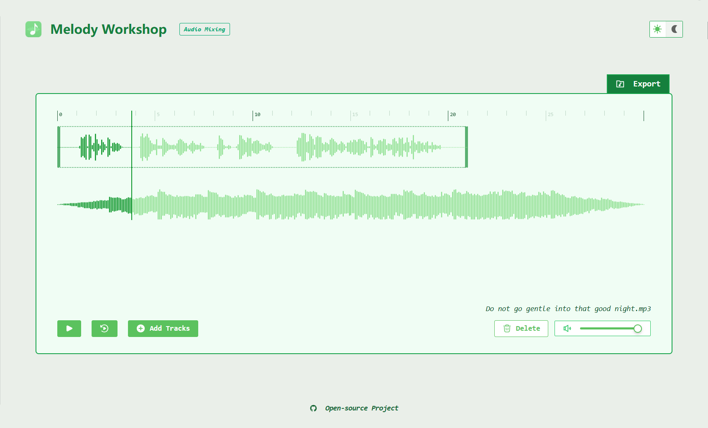

#  Melody Workshop

[English](./README.md) | 简体中文

## 🌷 效果预览
[](https://melody-workshop.rylan.cn/)




## 🔥 功能介绍

### 💕 单音频处理
- [x] 播放范围剪裁
- [x] 变调滤镜应用
- [x] 音量音速调节

### 💕 多音频混合
- [x] 文件添加删除
- [x] 轨道音量控制

### 💕 音频导出
- [x] 格式选择
- [x] 码率设置

## 🧙🏻 二次开发

 

如果你熟悉 Web 前端技术且对源码感兴趣，可以根据以下命令，在本地启动这个程序：

```sh
npm install # yarn
npm run dev
```

这里有一份架构图方便你更好理解整个项目：


以及一些也许对你有用的音频知识文章：

- [JS改变AudioBuffer音量并下载为新audio音频](https://www.zhangxinxu.com/wordpress/2023/10/js-web-audio-audiobuffer-volume/)
- [不改变音调情况下Audio音频的倍速合成JS实现](https://www.zhangxinxu.com/wordpress/2024/02/js-audioencoder-backplayrate-audiobuffer/)
