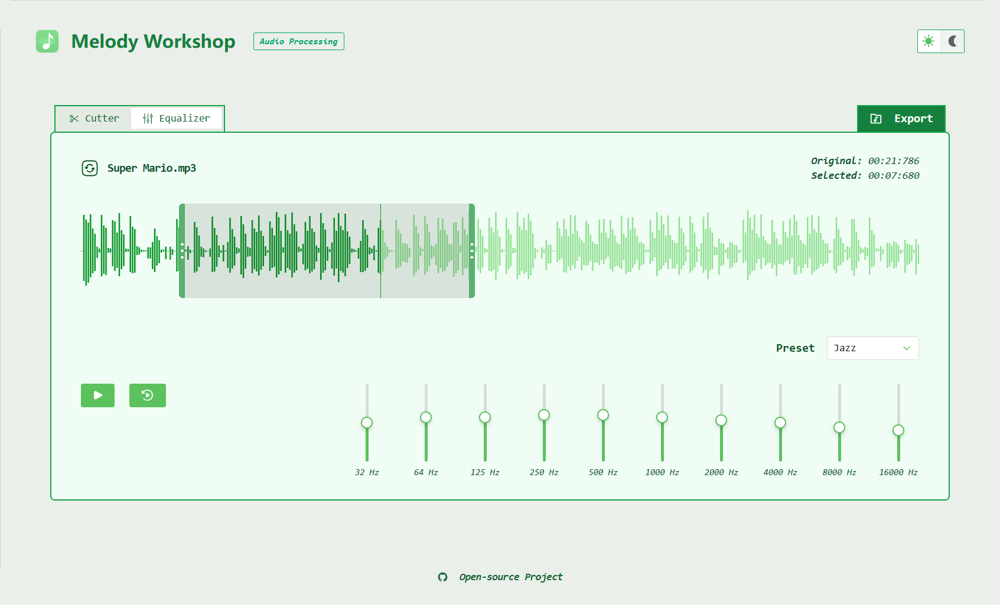
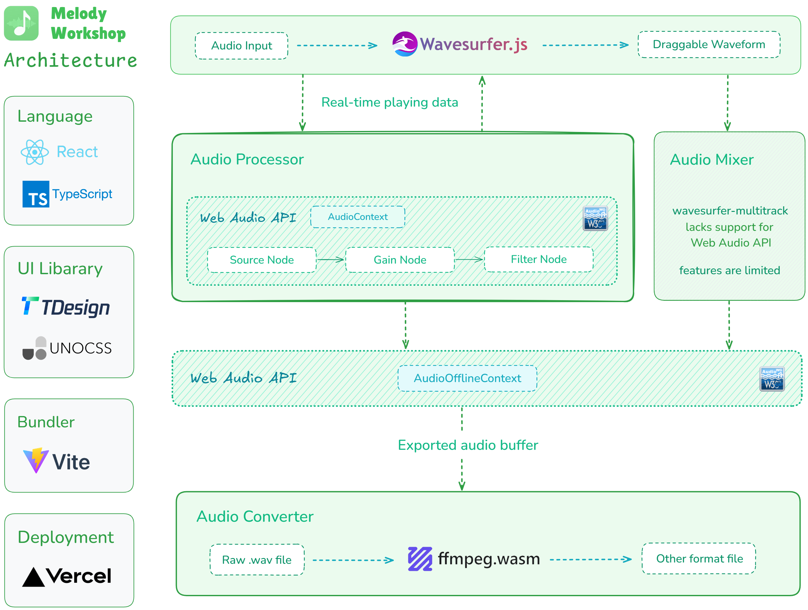

#  Melody Workshop

English | [简体中文](./README-CN.md) 

## 🌷 Preview
[](https://melody-workshop.rylan.cn/)




## 🔥 Features

### 💕 Single Audio Processing
- [x] Playback range trimming
- [x] Pitch filter application
- [x] Volume and speed adjustment

### 💕 Multiple Audio Mixing
- [x] File add and delete
- [x] Track volume control

### 💕 Audio Exporting
- [x] Format selection
- [x] Bit rate setting

## 🧙🏻 Development

 

If you are familiar with the Web frontend technologies and are interested in source code, you can run this program using the following commands:

```sh
npm install # pnpm install
npm run dev
```

Here is an architecture diagram to help you better understand the entire project:



Additionally, here are some audio-related articles that may be useful to you *(written in Chinese)*:

- [JS Implementation of Changing the Volume of an AudioBuffer and Downloading It as a New File](https://www.zhangxinxu.com/wordpress/2023/10/js-web-audio-audiobuffer-volume/)
- [JS Implementation of Speeding Up Audio without Changing Pitch](https://www.zhangxinxu.com/wordpress/2024/02/js-audioencoder-backplayrate-audiobuffer/)
